# Bike Sharing Demand

Saturday, June 1, 2019

## Abstract

Bike sharing systems are a means of renting bicycles where the process of obtaining membership, rental, and bike return is automated via a network of kiosk locations throughout a city. Using these systems, people are able to rent a bike from one location and return it to a different place on an as-needed basis. Currently, there are over 500 bike-sharing programs around the world.

The data generated by these systems makes them attractive for researchers because the duration of travel, departure location, arrival location, and time elapsed is explicitly recorded. Bike sharing systems therefore function as a sensor network, which can be used for studying mobility in a city. In this competition, participants are asked to combine historical usage patterns with weather data in order to forecast bike rental demand in the Capital Bikeshare program in Washington, D.C.

## Goal

To predict the total count of bikes rented during each hour covered by the test set, using only information available prior to the rental period.

## Data Description

The training set is comprised of the first 19 days of each month, while the test set is the 20th to the end of the month.

- **datetime** - hourly date + timestamp
- **season** -  1 = spring, 2 = summer, 3 = fall, 4 = winter
- **holiday** - whether the day is considered a holiday
- **workingday** - whether the day is neither a weekend nor holiday
- **weather** - 1: Clear, Few clouds, Partly cloudy, Partly cloudy

2: Mist + Cloudy, Mist + Broken clouds, Mist + Few clouds, Mist

3: Light Snow, Light Rain + Thunderstorm + Scattered clouds, Light Rain + Scattered clouds

4: Heavy Rain + Ice Pallets + Thunderstorm + Mist, Snow + Fog

- **temp** - temperature in Celsius
- **atemp** - &quot;feels like&quot; temperature in Celsius
- **humidity** - relative humidity
- **windspeed** - wind speed
- **casual** - number of non-registered user rentals initiated
- **registered** - number of registered user rentals initiated
- **count** - number of total rentals

_From [_https://www.kaggle.com/c/bike-sharing-demand/data_](https://www.kaggle.com/c/bike-sharing-demand/data)_

## Data Exploring

### Data Quality Check

Let&#39;s start with exploring dataset shape and size:

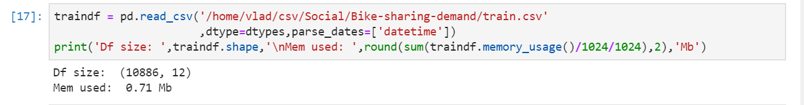
The dataset contains only 10K rows; hence, neither deep learning nor any data-intense models should be used.

Variables and their properties in the table below:

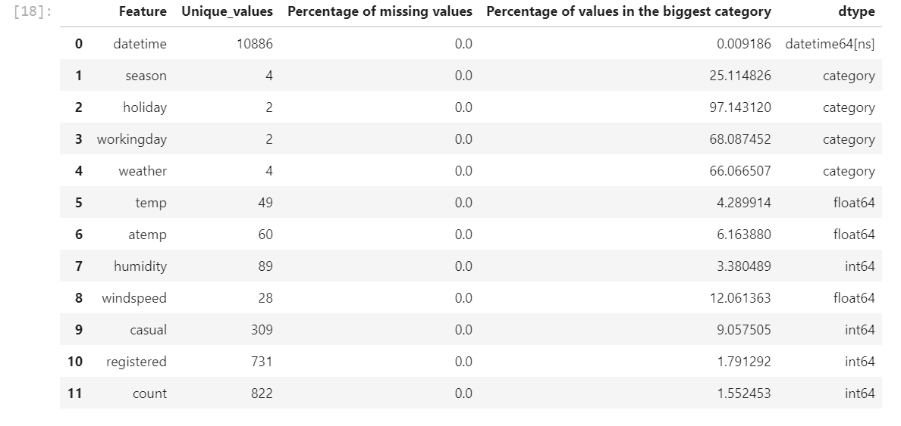


- The dataset equally splits between categorical and continuous variables: 4:4
- Neither of variables has a missing value
- Most of the variables are balances, except workday/weekend, which is expected.

Value distribution for each variable:

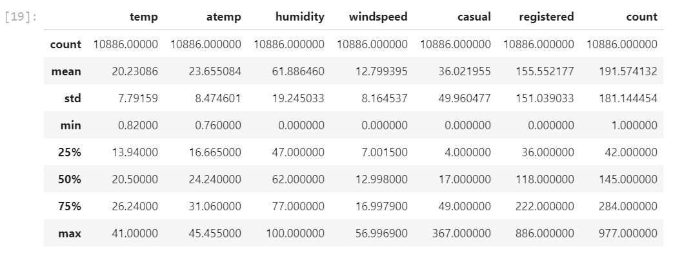


One can say that on average at every given time, there was 36 casual and 155 registered initiated.

The mean value for &quot;count&quot; can be used as a first dummy model and claim 191 bike initiates at any given time.

The mean of residuals for this model is 142.72. The concurrent model must be at least better than this.


### Categorical Variables Analysis

Seasonality detection – Checking is there any seasonal-caused patterns:


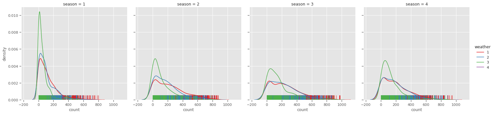
<p align="center">
figure 1
</p>
- People tend to use bikes more during the summertime and fall
- Fewer people use bikes during bad weather conditions: distribution has higher kurtosis when _weather_=3 and skewed &quot;long tails&quot; when _weather_ = 1 or 2


Total _count_ by season:

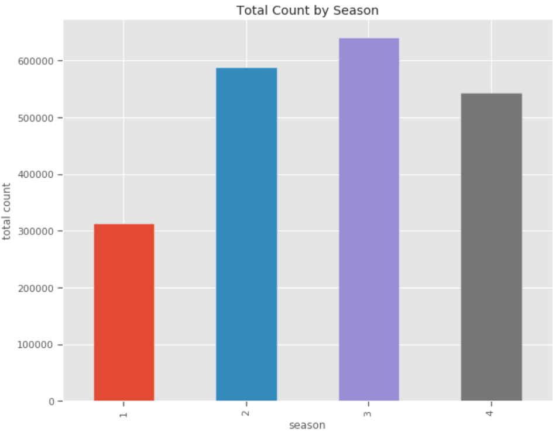

<p align="center">
figure 2
</p>

- Interesting that not summer but fall is the winner by total bike rents
- Spring is the loser by bike activities
- Summer and winter have approximately the same number of bikes rents


Average _count_ by season and weather:

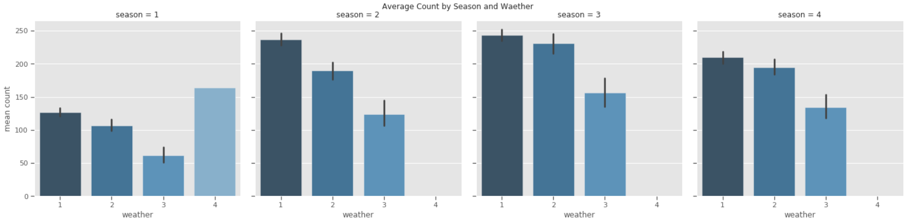

<p align="center">
figure 3
</p>

- In every season except first (spring), there&#39;re no people renting the bike during weather 4 (heavy rains)

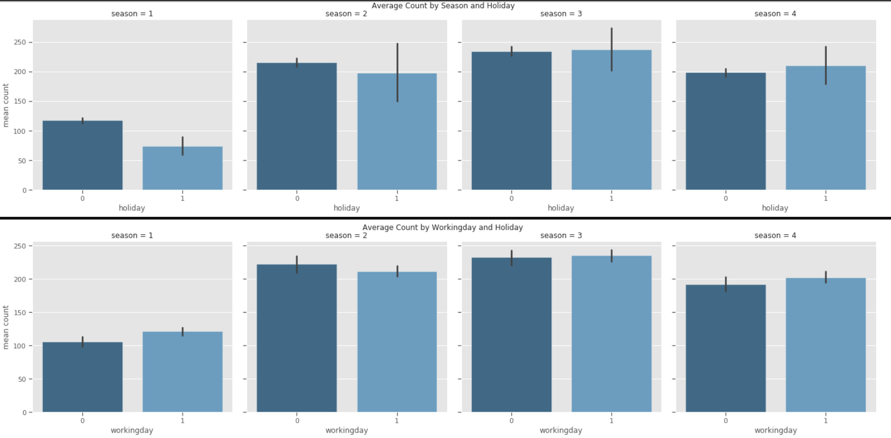

 <p align="center">
figure 4
</p>


- _Count_ variable looks quite balanced in both _workday_ category


### Correlation Analysis


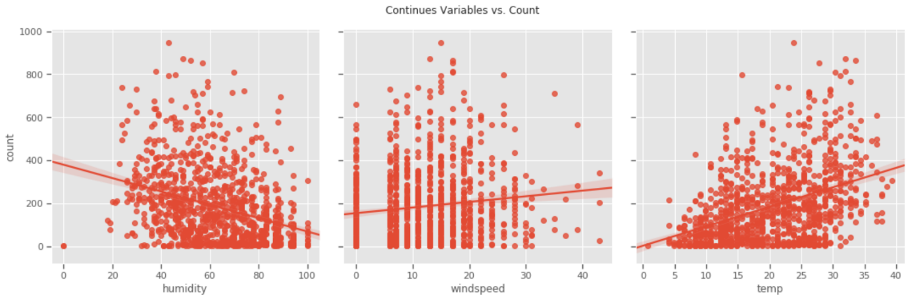

<p align="center">
figure 5
</p>

- The _count_ has a positive correlation with a _temp_ and negative with _humidity_.
- _Count and windspeed_ doesn&#39;t show any linear relationship, and hence this variable can be excluded from the model

Correlation matrix for continues variables:

|   | **humidity** | **windspeed** | **temp** | **count** |
| --- | --- | --- | --- | --- |
| **humidity** | 1.000000 | -0.318607 | -0.064949 | -0.317371 |
| **windspeed** | -0.318607 | 1.000000 | -0.017852 | 0.101369 |
| **temp** | -0.064949 | -0.017852 | 1.000000 | 0.394454 |
| **count** | -0.317371 | 0.101369 | 0.394454 | 1.000000 |

In the heatmap format:

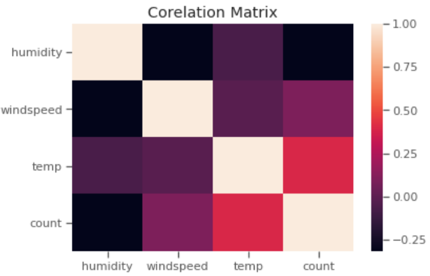

<p align="center">
figure 6
</p>


Next, let&#39;s explore the _count_ variable distribution:

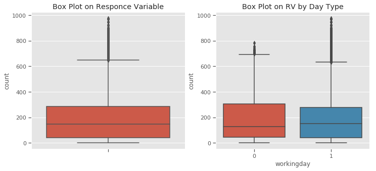
<p align="center">
figure 7
</p>


The _count_ variable is skewed toward the higher values. It can be that _workingday_ is responsible for the outliers since they appear more often when the variable is TRUE.

Check _count_ variable distribution for normality:

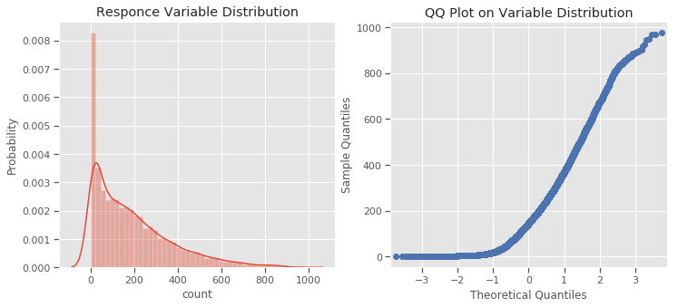

<p align="center">
figure 8
</p>

- Distribution and QQ plot shows that the _count_ is not normally distributed.

To be able to use linear models, it needs to be transformed into the &quot;normal&quot; space with outliers removed


### Feature Engineering

First additional feature will be a time category (_TimeCat_), a categorical variable with four levels: {0 - (from 04:00 to 10:00), 1- (from 10:00 to 16:00), 2 - (from 16:00 to 22:00), 3 - (from 22:00 to 04:00)}

Since people tent to use bikes more during the day, _TimeCat_ is skewed toward 1 and 2 values

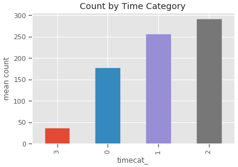

<p align="center">
figure 9
</p>

The second latent feature will be a combination of humidity and temperature:


Since _humidity_ has the opposite correlation sight with _temp_, the inverse ration is used. The quadratic relationship was added to highlight the importance of the _temp_ over the _humidity._

The _temp_ and _atemp_ variables are transformed to a category by round each value to the whole number.


## Model Engineering

As it was said before, the first baseline model is a simple mean prediction.

R^2 estimation of this model is:
```
        ---Baseline Score---
           R^2 test = -0.06
           R^2 train=-0.0
```
 _Applying_ StandardScaler and fit data to SDG linear regression with a least squares loss function:
```
        ---GB (no reg) Score---
           R^2 test = 0.2

      MAE=0.62
```


The second model was applied is a gradient boosted decision tree with the xgboost library.

With parameters:
```
params = {'max_depth': 6,
 'min_child_weight': 1,
 'subsample': 1,
 'colsample_bytree': 1,
 'eta': 0.3,
 'objective': 'reg:squarederror',
 'eval_metric': 'mae'
         }

```
 The model has accuracy:

```
Stopping. Best iteration:
[36]        Test-mae:0.43
```


The optimization trace plot for the estimator:

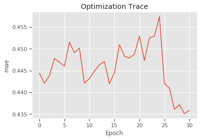

<p align="center">
figure 10
</p>


The feature importance plot:

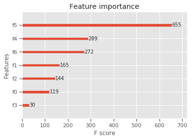

_figure 11_


Feature description:

```
0: 'weather', 1: 'season', 2: 'workingday', 3: 'holiday', 4: 'timecat_',5: 'humidity_temp_', 6: 'atemp_', 7: 'count'
```

_f5_ and _f4_ seem to have the highest impact on the expected number of bikes to be rented. Indeed, weather and time of the day can be a key factor for bike traffic.

## Conclusion

In this research a few different approaches were used to predict the bike sharing demand. The XGboost model showed the best performance, hence was selected as a primary solution.

During the data exploration, several latent features were introduced, which lead to a better description of the underlying processes.
